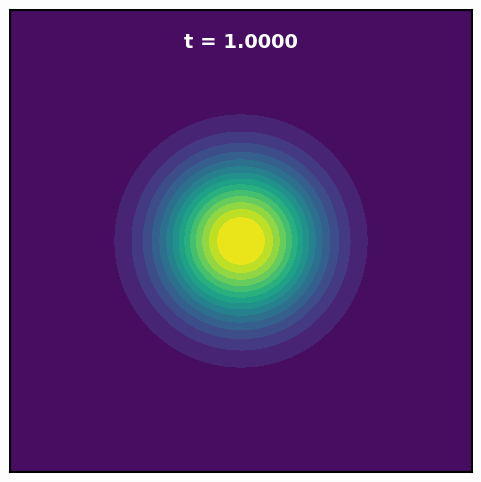
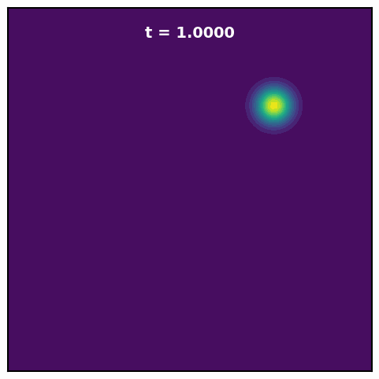
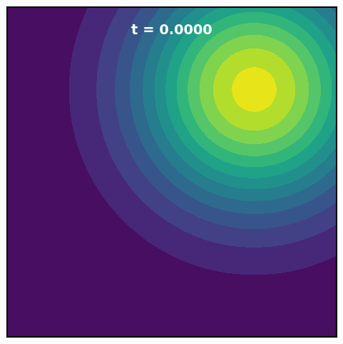

# DeepNeuralSamplers

This is an implementation of [https://arxiv.org/abs/2410.03282](https://arxiv.org/abs/2410.03282) by Chemseddine et. al. and [https://arxiv.org/abs/2410.03282](https://arxiv.org/abs/2301.07388) by Máté et al. to learn samplers from unnormalized densities. We implement gradient flow, learned and linear interpolations and provide examples on more target distributions.

<div align="center">
  <table>
    <tr>
      <td align="center"><b>Rings - GF</b><br>
        
      </td>
      <td align="center"><b>Rings - Learned</b><br>
        
      </td>
      <td align="center"><b>AsymGMM - GF</b><br>
        
      </td>
      <td align="center"><b>AsymGMM - Learned</b><br>
        
      </td>
    </tr>
  </table>
</div>

---

## Quick Start

First, install dependencies:

```bash
uv sync
```

or withotu uv 

```bash
pip install -e .
```

### Train a single variant:

```bash
uv run python -m src.trainer --config rings_gf --num_modes 4 --radius 1.0 --sigma_rings 0.15
```


### Run all three variants in parallel:

```bash
uv run python -m src.run_all_variants --target funnel --sigma_funnel 3.0
```

### Available Target Distributions

- **Asymmetric GMM** - (similar to the one from  [Máté et al.](https://arxiv.org/abs/2301.07388))
  - Parameter: `--mean_offset` (default: 8.0)
  - Config: `asymmetric_gmm_gf`, `asymmetric_gmm_learned`, `asymmetric_gmm_linear`

- **Rings** - 2D ring distribution 
  - Parameters: `--num_modes` (default: 4), `--radius` (default: 1.0), `--sigma_rings` (default: 0.15)
  - Config: `rings_gf`, `rings_learned`, `rings_linear`

- **Neal's Funnel** - Example of non $\beta$-smooth distribution
  - Parameter: `--sigma_funnel` (default: 3.0)
  - Config: `funnel_gf`, `funnel_learned`, `funnel_linear`

## Configs

All configs are in `src/configs/`. Some parameters that might be important:
- `--config`: Specific config to use (e.g., funnel_gf, asymmetric_gmm_learned, rings_linear)
- `--sigma_funnel`: Funnel sigma parameter (only does something if target is funnel)
- `--mean_offset`: GMM mean offset (only does something if target is asymmetric_gmm)
- `--num_modes`: Number of modes for Rings (only does something if target is rings)
- `--radius`: Radius for Rings
- `--sigma_rings`: Sigma for Rings
- `--ntrain`: Number of training steps

## Structure

```
src/
├── trainer.py              # Main training script
├── models.py               # Neural Networks
├── loss.py                 # Loss functions
├── evaluation.py           # Plotting and Eval
├── compute_action_direct.py # Computation of Action
├── run_all_variants.py     # Run all three variants in parallel
├── default_factories.py     # Model factory functions
├── flow_wrappers.py        # Flow utilities
├── configs/                # Configuration classes
│   ├── base_config.py
│   ├── Funnel_configs.py
│   ├── GMM_configs.py
│   └── Rings_configs.py
└── fab/                    
    ├── utils/              
    └── target_distributions/  # Target distributions
```


### TODO:

This codebase is still WIP, i.e. the wandb integration is not fully updated and eval in general needs some work (big eval not used consistently). 
